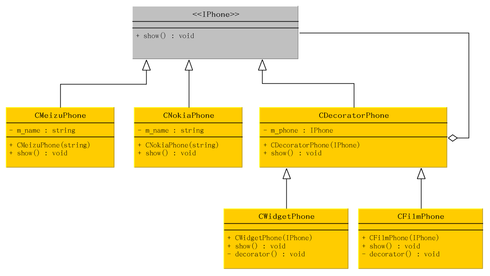

# 什么是装饰器模式
动态地给一个对象添加一些额外的职责，就增加功能来说，装饰器比生成子类更灵活。

装饰模式是为已有功能添加更多功能的一种方式。

> 每个装饰对象只需要关心自己的功能，不需要关心如何被添加到对象链当中。

# 优点
把类中的装饰功能从类中去除，这样可以简化原有类。有效地把类的核心职责和装饰功能区分开，而且可以去除相关类中重复的装饰逻辑。

# UML

`IPhone` 定义了一个对象接口，可以给这些对象动态地添加职责。`CMeizuPhone` 和 `CNokiaPhone` 定义了具体的对象，也可以给这个对象添加一些职责。装饰器类 `CDecoratorPhone` 继承了 `IPhone`，从外部来扩展其功能。但对于 `IPhone` 来说，是无需知道 `CDecoratorPhone` 的存在。`CWidgetPhone` 和 `CFilmPhone` 就是具体的装饰对象了，起到给 `IPhone` 添加职责的功能。
