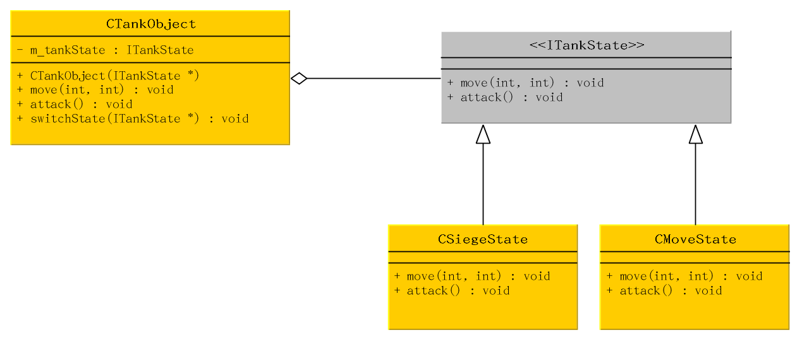

# 什么是状态模式
当一个对象的内在状态改变时，允许改变其行为，这个对象看起来像是改变了其类。

状态模式主要解决的问题是当控制一个对象状态转换的条件表达式过于复杂时，把状态的判断逻辑转移到表示不同状态的一系列类当中，可以简化复杂的判断逻辑。

> 为了消除庞大的分支语句。

# 优点
将与特定状态相关的行为局部化，并且将不同状态的行为分割开来。

# 使用
当一个对象的行为取决于它的状态，并且它必须在运行时刻根据状态改变它的行为时，就可以考虑使用状态模式了。

# UML

