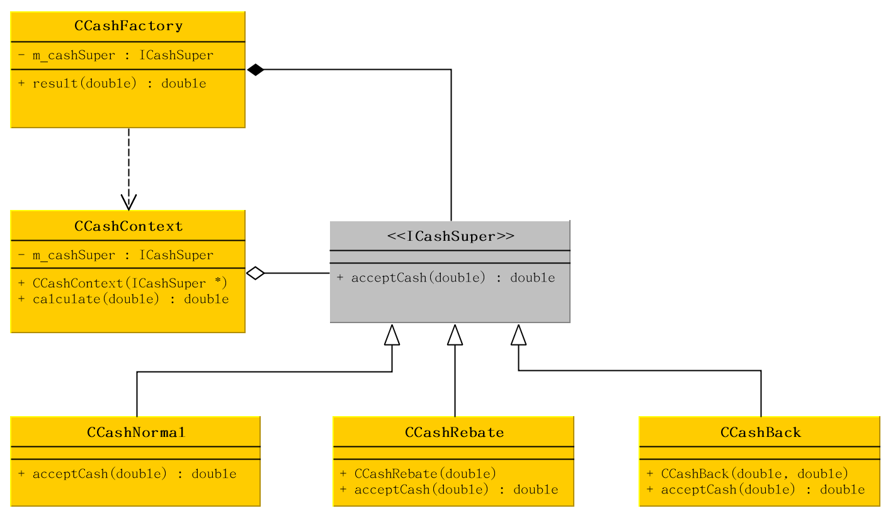

# 什么是策略模式
它定义了算法家族，分别封装起来，让它们之间可以互相替换，此模式让算法的变化，不会影响到使用算法的客户。

策略模式是一种定义一系列算法的方法，从概念上来看，所有这些算法完成的都是相同的工作，只是实现不同，它可以以相同的方式调用所有算法，减少了各种算法类与使用算法类之前的耦合。

> 策略模式封装了变化。

# 优点
- 简化了单元测试，因为每个算法都有自己的类，可以通过自己的接口单独测试；

# UML 类图

